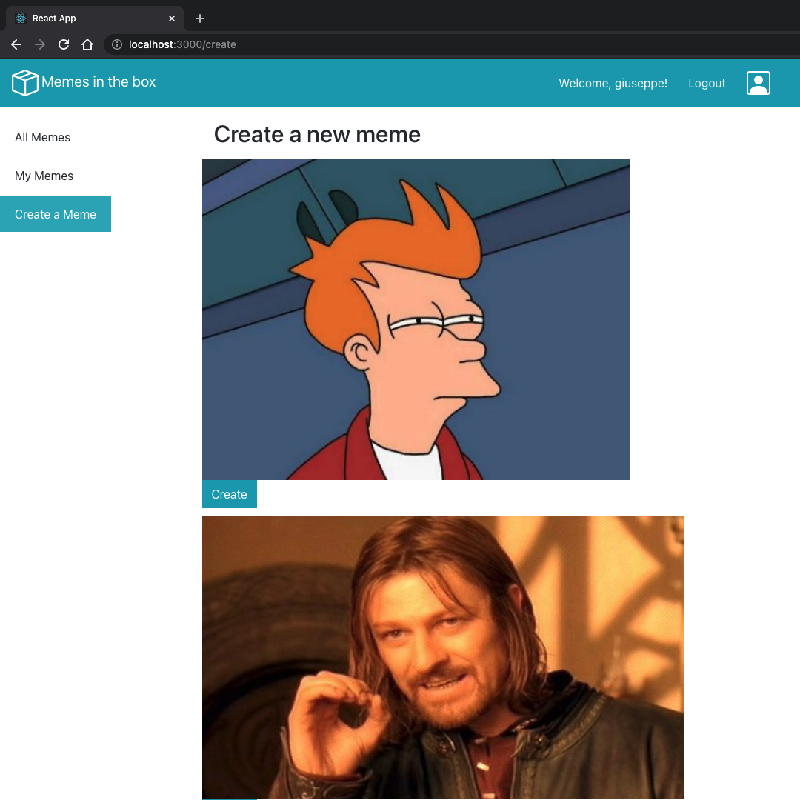

# Exam #2: "Meme Generator"
## Student: s286286 GAGLIARDI GIUSEPPE 

## React Client Application Routes

- Route `/`: it shows the whole list of memes. Users can see the properties of each meme, only creators can copy them.
- Route `/create`: it allows to create a meme from scratch, by choosing among the predefined background. Only creators can access to this route.
- Route `/mymemes`: it shows the list of the meme made by the creator which is logged in. Only creators can access to this route.

## API Server

- retrieve the list of all the available memes  
  GET '/api/memes'  
   
  Response: 
  {"id":1, "title" :"first_meme", "image":"futurama_fry", "top":"if chip companies sell air", "center":"", "bottom":"then do air companies sell chips", "font":"meme-font", "color":"white", "visibility":1, "creator":1} 
  {"id":4, "title" :"new_back", "image":"one_does_not_simply", "top":"one does not simply", "center":"", "bottom":"say no to free food samples", "font":"meme-font", "color":"white", visibility":1, "creator":1} 
  {"id":5, "title" :"try_overwrite", "image":"marked_safe_from", "top":"", "center":"aliens", "bottom":"", "font":"arial", "color":"white", visibility":0, "creator":1} 
  {"id":6, "title" :"first_att", "image":"futurama_fry", "top":"is it me that hates mondays", "center":"", "bottom":"or do mondays hate me...", "font":"meme-font", "color":"white", "visibility":0, "creator":3} 
  {"id":8, "title" :"arnold_tries_hard", "image":"hide_the_pain", "top":"perfect", "center":"i made a friend", "bottom":"in league of legends", "font":"arial", "color":"yellow", visibility":0, "creator":3} 
  {"id":9, "title" :"dinkleberg", "image":"if_i_had_one", "top":"this is where i'd put", "center":"my master in software engineering", "bottom":"if i had one", "font":"meme-font", "color":"white", visibility":1, "creator":3} 
  {"id":11, "title" :"I'll try to survive", "image":"marked_safe_from", "top":"", "center":"anxiety", "bottom":"", "font":"meme-font", "color":"white", visibility":1, "creator":2} 
  {"id":12, "title" :"great meme", "image":"one_does_not_simply", "top":"one does not simply", "center":"", "bottom":"\"calm down\"", "font":"meme-font", "color":"white", visibility":0, "creator":2} 
  {"id":13, "title" :"feelings", "image":"goosebumps", "top":"", "center":"i have oreos", "bottom":"", "font":"arial", "color":"yellow", visibility":1, "creator":2} 

- create new meme, by providing all relevant information –except the “id” that will be automatically assigned by the back-end  
    POST '/api/memes' 
     
    {"id": 14, "title" :"new_try", "image":"futurama_fry", "top":"not sure if everything is expensive", "center":"", "bottom":"or i am just poor", "font":"meme-font", "color":"white", "visibility":0, "creator":1}

- delete an existing meme, given its “id”  
    DELETE '/api/memes/:id'

- login 
  POST /api/sessions 
   
  {username:"username", password:"password"} 

  response: 
  {"id":1,"username":"giuseppe"} 

- logout 
  DELETE /api/sessions/current 

- Get current session 
  GET /api/sessions/current 

  response: 
  {"id":1,"username":"giuseppe"}

## Database Tables

- Table `users` - contains id, username, password. 
- Table `memes` - contains id, title, image, top, center, bottom, font, color, visibility, creator. 

## Main React Components

- `MemeNavbar` (in `MemeNavbar.js`): contains React-bootstrap components in order to implement a navbar and it calls the component ModalLogin by clicking on two complementary button components LoginButton and LogoutButton
- `LoginButton` (in `loginComponents.js`): provides a Button which opens a login form (by its property setShow) when it is clicked on 
- `LogoutButton` (in `loginComponents.js`): just call the function to logout that receives as property (doLogOut is implemented in `App.js`)
- `ModalLogin` (in `loginComponents.js`): a modal component that will show a form to perform login calling doLogIn (`App.js`)
- `MemePage` (in `MemePage.js`): it is called in `App.js` and it provides to handle the Route's rendering to call the following components
- `MemeSidebar` (in `MemePage.js`): a sidebar with a ListGroup component that allow the user to browse among the routes. It will show only the path which I allowed to visit
- `ButtonProps` (in `MemePage.js`): provide a button to show in `All memes` in order to visualize the properties of a meme
- `ButtonDelete` (in `MemePage.js`): it is disabled if the user is not the creator of the meme. The creator should press the button to delete its own meme (calling the inherited function deleteMeme, implemented in `API.js`)
- `ButtonMod` (in `MemePage.js`): performs the creation of a meme through a Modal component. When the user clicks on the save button, this components calls the inherited function addMeme, implemented in `API.js`. 

(only _main_ components, minor ones may be skipped)

## Screenshot
- Before clicking on "Create" button

- After clicking on "Create" button 

- When mandatory fields are missing

- After filling out the form 

- When user want to copy from one meme

- Form that opens when user tries to copy from a meme

## Users Credentials

- id:1, username: giuseppe, password: ciao96
- id:2, username: davide1, password: hello123
- id:3, username: martina96, password: hola42

